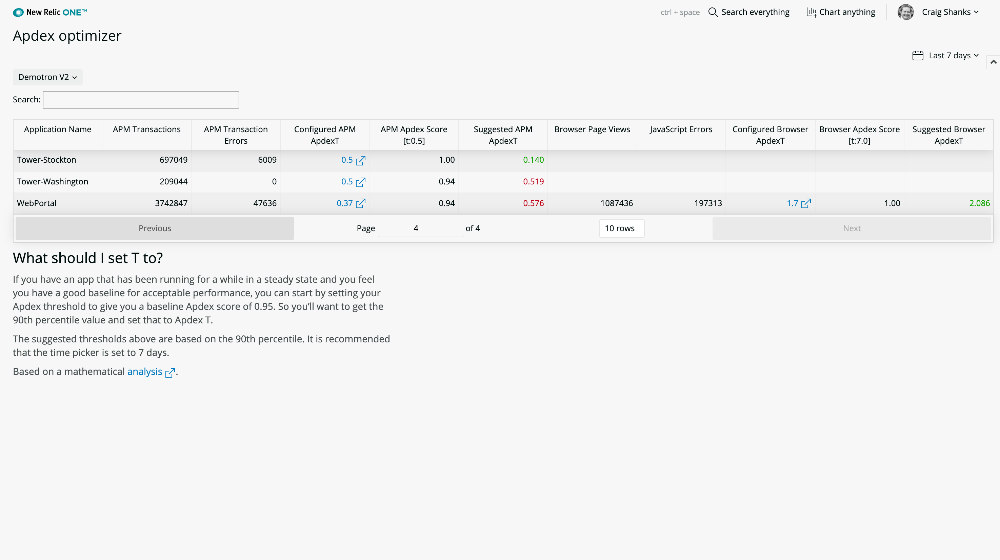

[](https://github.com/newrelic/open-source-office/blob/master/examples/categories/index.md#category-community-project)

# nr1-apdex-optimizer

 [](https://snyk.io/test/github/newrelic/nr1-apdex-optimizer)

## Usage

nr1-apdex-optimizer provides actionable recommendations for Apdex threshold settings. These recommendations are based on existing best practices and provide links to the relevant page where you can make the suggested changes.

This Nerdpack lists APM and Browser applications for an account in a table. For each application, you can see the currently configured Apdex thresholds along with links to the application settings page where you can change the Apdex threshold (ApdexT). The table also lists suggested APM and Browser Apdex thresholds, which are updated based on the time picker period.





For great advice on choosing the right Apdex threshold, see Bill Kayser's New Relic [blog post](https://blog.newrelic.com/product-news/how-to-choose-apdex-t/).

### About this Nerdpack

The application relies upon a combination of native NerdGraph and NRQL-based queries. It consists of two top-level React components, the first to identify and list available accounts, and the second to render the table. The table is based on a third-party open source React library, called react-table. It can be sorted on every column, provides pagination, and allows relevant cells to be filtered based on a search term. We have added throughput and errors so you can use those values for prioritization.

## Open source license

This project is distributed under the [Apache 2 license](LICENSE).

## What do you need to make this work?

Make sure you have [New Relic APM](https://newrelic.com/products/application-monitoring) and/or [Browser agents](https://newrelic.com/products/browser-monitoring) installed, as well as related access to [New Relic One](https://newrelic.com/platform).

## Getting started

1. Ensure that you have [Git](https://git-scm.com/book/en/v2/Getting-Started-Installing-Git) and [NPM](https://www.npmjs.com/get-npm) installed. If you need to check, run the following commands, which will return version numbers if you have one or both installed, and will not be recognized if you don't.

```bash
git --version
npm -v
```

2. Follow the [**Quick start**](https://one.newrelic.com/launcher/developer-center.launcher) instructions to install the NR1 CLI (5 minutes or less) and set up your New Relic development environment.

3. Clone this repo and run the code locally against your New Relic data:

```bash
nr1 nerdpack:clone -r https://github.com/newrelic/nr1-apdex-optimizer.git
cd nr1-apdex-optimizer
nr1 nerdpack:serve
```

Visit [https://one.newrelic.com/?nerdpacks=local](https://one.newrelic.com/?nerdpacks=local), navigate to the Nerdpack, and :sparkles:

## Deploying this Nerdpack

Open a command prompt in the Nerdpack's directory and run the following commands.

```bash
# If you need to create a new uuid for the account to which you're deploying this Nerdpack, use the following
# nr1 nerdpack:uuid -g [--profile=your_profile_name]
# to see a list of APIkeys / profiles available in your development environment, run nr1 credentials:list
nr1 nerdpack:publish [--profile=your_profile_name]
nr1 nerdpack:deploy [-c [DEV|BETA|STABLE]] [--profile=your_profile_name]
nr1 nerdpack:subscribe [-c [DEV|BETA|STABLE]] [--profile=your_profile_name]
```

Visit [https://one.newrelic.com](https://one.newrelic.com), navigate to the Nerdpack and get started.

### Tips for using the app

* If you have an app that has been running for awhile in a steady state and you have a good baseline for acceptable performance, set your Apdex threshold to give you a baseline Apdex score of 0.95. To do this, get the 90th percentile value and set that to Apdex T and set the time picker to 7 days. For information information, see [Changing your Apdex settings](https://docs.newrelic.com/docs/apm/new-relic-apm/apdex/change-your-apdex-settings). 
* When deploying to a master account, select each sub-account from a drop-down menu. If deployed to a single sub-account, the account is automatically selected.

# Support

New Relic has open-sourced this project. This project is provided AS-IS WITHOUT WARRANTY OR DEDICATED SUPPORT. Issues and contributions should be reported here on GitHub.

We encourage you to bring your experiences and questions to the [Explorers Hub](https://discuss.newrelic.com) where our community members collaborate on solutions and new ideas.

## Community

New Relic hosts and moderates an online forum where customers can interact with New Relic employees as well as other customers to get help and share best practices. Like all official New Relic open source projects, there's a related Community topic in the New Relic Explorers Hub. You can find this project's topic/threads here:

https://discuss.newrelic.com/t/nr1-apdex-optimizer-nerdpack/92054

## Issues / enhancement requests

Issues and enhancement requests can be submitted in the [Issues tab of this repository](../../issues). Please search for and review the existing open issues before submitting a new issue.

# Contributing

Contributions are welcome and we encourage you to submit enhancements. Please review our [Contributors Guide](CONTRIBUTING.md) before you begin.

When you submit your pull request, you'll need to sign the CLA by using CLA-Assistant. If you'd like to execute our corporate CLA, or if you have any questions, please drop us an email at opensource+nr1-apdex-optimizer@newrelic.com.
